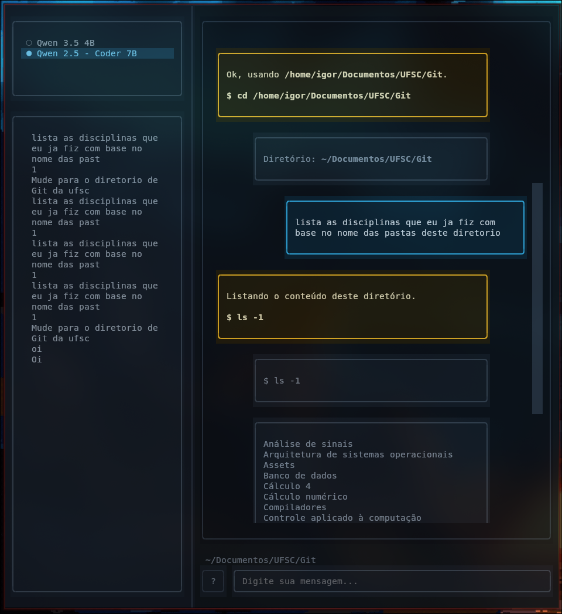

# Xhat

### Assistente de terminal com IA local — português → Linux, com você no controle

<p align="center">
  
</p>

<p align="center">
  <b>Chat no terminal</b> · <b>Modelos locais (Ollama)</b> · <b>Confirmação antes de executar</b> · <b>~0 RAM em repouso</b>
</p>

---

Fale em português. O Xhat traduz para comando Linux, mostra o que vai rodar e **só executa com a sua aprovação**.

Tudo roda **na sua máquina** — sem enviar prompts para a nuvem.


| Para você                        | Para o recrutador / time técnico             |
| -------------------------------- | -------------------------------------------- |
| Menos decorar `find`, `du`, `cd` | Projeto full-stack de CLI com TUI real       |
| Contexto do diretório atual      | Python + Textual + integração Ollama         |
| Troca de modelo na própria UI    | Arquitetura com memória em disco, não em RAM |
| Pesquisa web quando o fato exige | Segurança: confirmação + detecção de perigo  |


---


## Por que existe

O terminal é poderoso, mas a sintaxe atrapalha. O Xhat encurta o caminho:

1. Você descreve o que quer
2. A IA interpreta e sugere o comando
3. Você **aplica, edita ou cancela**
4. O resultado aparece no chat

No print acima: *“lista as disciplinas… deste diretório”* → `ls -1` em `~/Documentos/UFSC/Git`, com saída real do shell.

---


## Destaques


|                             |                                                                      |
| --------------------------- | -------------------------------------------------------------------- |
| **100% local**              | Modelos via [Ollama](https://ollama.com) — privacidade e uso offline |
| **Humano no loop**          | Nenhum comando destrutivo sem **Aplicar**                            |
| **Dois modelos**            | `Qwen 3.5 4B` (leve) e `Qwen 2.5 - Coder 7B` (código/shell)          |
| **Recurso sob demanda**     | `keep_alive=0` — carrega, responde, descarrega                       |
| **Memória em arquivos**     | Contexto em `~/.xhat/*.md`, sem acumular conversa na RAM             |
| **Dois modos**              | TUI interativa ou single-shot (`--yes` / `--dry-run`) para scripts   |
| **Consciente do cwd**       | Navega pastas, lista conteúdo e age no diretório atual               |
| **Pesquisa quando precisa** | Fatos externos vão à web; saudação e terminal não                    |


---


## Stack

```
Python 3  ·  Textual (TUI)  ·  Ollama (LLM local)  ·  DuckDuckGo (pesquisa opcional)
```

Arquitetura em módulos pequenos (`brain`, `llm`, `memory`, `executor`, `tui`…) — fácil de ler e evoluir. Visão de produto em `[IDEIA.md](IDEIA.md)`.

---


## Instalação rápida

**Num PC zerado**, o script cuida do essencial:

```bash
chmod +x instala.sh
./instala.sh
```

| O que ele faz | Detalhe |
|---------------|---------|
| Python + deps | Ambiente em `~/.local/share/xhat/` (você **não** ativa venv) |
| Comando | `Xhat` em `~/.local/bin` (PATH automático) |
| Ollama + modelos | Instala e faz `pull` (use `--sem-ollama` para pular) |
| Abre a TUI | No final (use `--sem-abrir` para só instalar) |

| Flag | Efeito |
|------|--------|
| `./instala.sh` | Instala tudo + Ollama/modelos + abre |
| `./instala.sh --sem-abrir` | Só instala |
| `./instala.sh --sem-ollama` | Não instala/puxa Ollama |

Depois, em qualquer terminal: **`Xhat`**.

---


## Uso


| Comando                              | Efeito                               |
| ------------------------------------ | ------------------------------------ |
| `Xhat`                               | Abre o chat (TUI)                    |
| `Xhat 'mover a.txt para /tmp'`       | Uma pergunta → comando + confirmação |
| `Xhat --dry-run 'apagar logs'`       | Só mostra o comando                  |
| `Xhat --yes 'compactar pasta build'` | Executa sem perguntar (automação)    |
| `Xhat -M coder '…'`                  | Usa o Coder nesta execução           |


### Na TUI


| Ação              | Como                                    |
| ----------------- | --------------------------------------- |
| Trocar modelo     | Clique na lista à esquerda              |
| Reusar pedido     | Clique no histórico                     |
| Confirmar comando | **Aplicar** / **Editar** / **Cancelar** |
| Ajuda             | Botão `?` ou `/ajuda`                   |
| Shell direto      | `!comando` (ainda com confirmação)      |


Dados locais: `~/.xhat/` (fora do git).